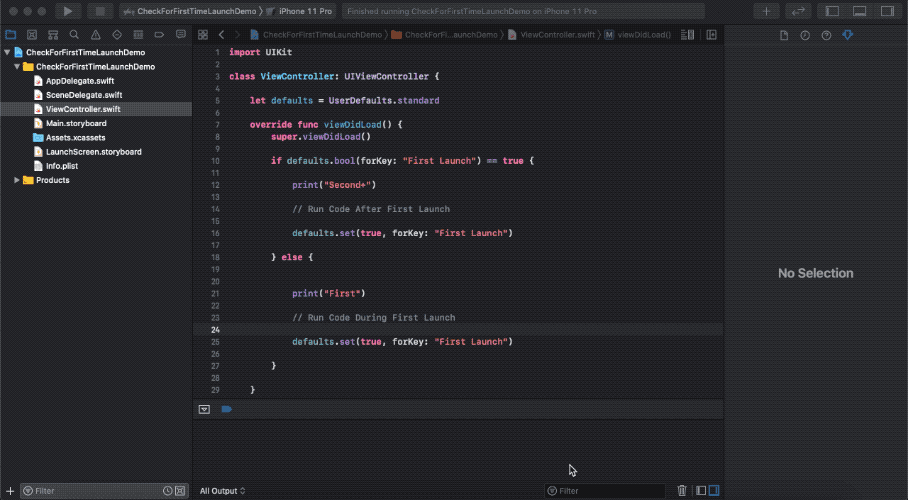

# CheckForFirstTimeLaunchDemo

CheckForFirstTimeLaunchDemo demo app

## Requirements

- Xcode 10 or later
- iOS 12

## How to build

- Change the **Team** setting in the **General** tab for each target.
- Build & Run with **Xcode 10** or later

## How to use

- Launch iOS app with Xcode
- Kill app in app switcher
- Launch iOS app again with Xcode

## Known Issues

- N/A

## Author

**Eric Walker**

Software/hardware hobbyist in Akron Ohio

- GitHub Landing Page:  [My Work](https://ewalk40.github.io/)
- Social: [Twitter](https://twitter.com/ewalk40) / [LinkedIn](https://www.linkedin.com/in/eric-walker-003364117)
